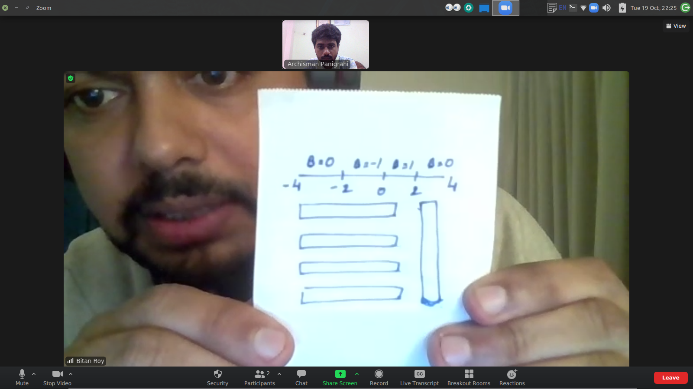

- ~~Gridlines between black-black, blue-blue and blue-black to represent H11,H22,H12~~ 

- ~~Same picture with dislocation center~~

- LDoS plots for edge states - endpoint modes for 
four values m = 1,-1,3,-3 --same colorbar


- One dimensional phase diagram of m_0/t_0 from -4 to 4


```

-4 to -2 --> B=0
-2 to 0 B=-1
0 to 2 B=+1
2 to 4 B=0

3
1   long vertical colorbar
-1
3
```

- Dislocation (two panel figure)

(a) Same picture with dislocation center

(b) 

*Check notebook for this one.*

