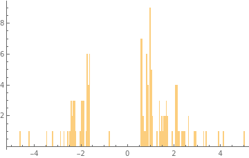
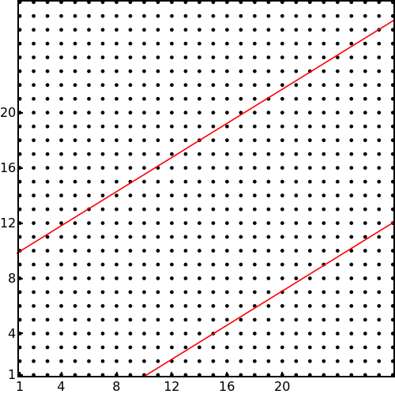
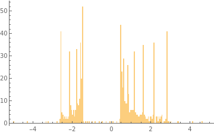

# Magnetic Field

## Pierls' substitution
Hoppings are modified as,
$t_{ij} \rightarrow t_{ij} e^{i\frac{e}{\hbar}\int_i^j \vec{A} \cdot d\vec{r}}$

$\vec{B} = B \hat{z}$. We choose gauges $\vec{A}_1 = (-By, 0, 0)$ 
and $\vec{A}_2 = (0, Bx, 0)$.

Since the gauge choice breaks translational symmetry, we use *Open Boundary Conditions*.

Set $e = \hbar = 1$.

## Tight binding on a 2D square lattice with a single orbital per site

$h(k_x, k_y) = cos(k_x) + cos(k_y)$

### $B = 0.5$
 

We can plot a histogram to see the density of states.

The eigenvalues are same upto $10^{-14}$ order for both the gauges.

### The spacing increases with magnetic field
$B = 1$

 

## Weyl Semimetals

$ h = t \sin{k_x} \sigma_x + t \sin{k_y} \sigma_y + \sigma_z (t_1 (\cos{k_x} + \cos{k_y}) - m + cos(k_z))$

First we fix $k_z = \frac{\pi}{2}$, so that there is no hopping along $z$ (Chern insulator).
Also, $t = t_1 = m = 1$.

_For *zero magnetic field*_

For $B =1$, the spectrum shifts towards negative energies, and there are Landau levels.

If we plot the energy eigenvalues as  function of $k_z$, we get a plot like the following.

## Chern insulator and Quasicrystal

### Thin quasicrystal strip

We fix the same parameters as in the previous Hamiltonian, and turn off hopping along $z$.
For a thin quasicrystal strip, the Landau levels are not very prominent.
$$y_{up} = \frac{2}{\sqrt{5}+1}(x-1)+4$$

$$y_{down} = \frac{2}{\sqrt{5}+1}(x-2)+2$$

 $9.2 \%$ of sites are inside the quasicrtstal 

 Landau levels are not very prominent 

### Thick strip

$$y_{up} = \frac{2}{\sqrt{5}+1}(x-1)+10$$

$$y_{down} = \frac{2}{\sqrt{5}+1}(x-2)-4$$

