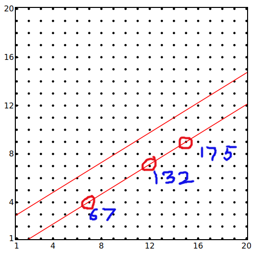
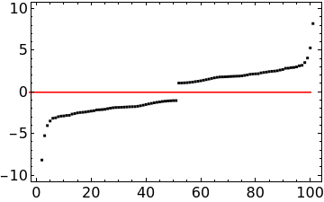
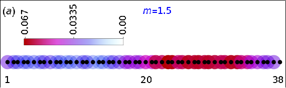
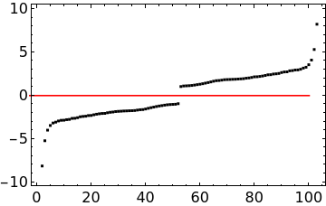
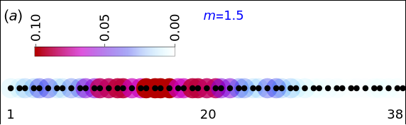
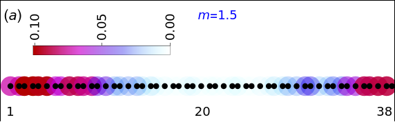
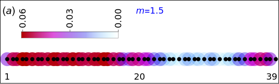
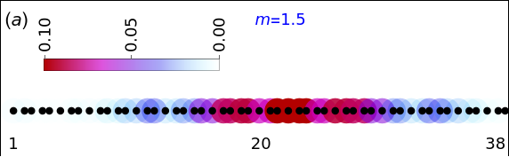

I take a 20x20 *periodic* system, and fix 

$y_{up} = \frac{2}{1+\sqrt{5}}(x - 1) + 3 $

and $y_{down} = \frac{2}{1+\sqrt{5}}(x - 1) + 1 $

The elements in the list are `1, 21, 22, 23, 42, 43, 44, 45, 63, 64, 65, 66, 85, 86, 87, 88, 106,
107, 108, 109, 110, 128, 129, 130, 131, 150, 151, 152, 153, 171, 172,
173, 174, 193, 194, 195, 196, 214, 215, 216, 217, 218, 236, 237, 238,
239, 258, 259, 260, 279, 280`

 Sites 67, 132 and 175 are initially not included 

Fix $m = 1.5$. The energies are,

And the probability density of the highest occupied orbital is,

# After introducing Phason only at site 175

The energies are almost unchanged.

And the probability density of the highest occupied orbital is,

# After introducing Phason only at site 132

The probability density of the highest occupied orbital is,

# After introducing Phasons at sites 132 and 175

The probability density of the highest occupied orbital is,

# After introducing Phason only at site 67

The probability density of the highest occupied orbital is,

## Result: 
Wherever a phason is introduced, the 
density of the highest occupied state 
at that point decreases. 

But this does not happen for other states.

Also, the density profile is very different for the
 lowest unoccupied state and the highest occupied state.